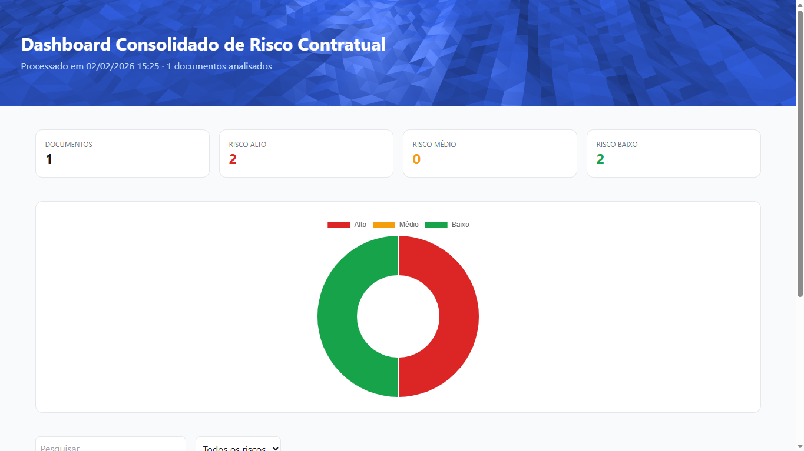

# Law Assist - Analista de Prevenção da Corrupção ⚖️

O **Law Assist** é uma ferramenta de auditoria inteligente desenvolvida em **C#** que utiliza o modelo **Gemini 2.5 Flash** para analisar editais, cadernos de encargos e documentos de contratação pública. O objetivo é identificar automaticamente cláusulas restritivas, indícios de direcionamento ou riscos de corrupção.

## 🚀 Funcionalidades

-   **Análise Multimodal:** Processamento direto de documentos PDF (Cadernos de Encargos).
    
-   **Detecção de Vícios:** Identificação de especificações técnicas que limitam a concorrência.
    
-   **Relatório de Risco:** Geração de um parecer técnico pontuado de 1 a 5.
    
-   **Integração com Portal BASE:** Focado na estrutura de dados da contratação pública em Portugal.
    
## 📂 Fluxo de Entrada e Saída

Entrada: Um ficheiro PDF com o Caderno de Encargos.

Processamento: O software analisa o PDF, identifica riscos e calcula scores.

Saída:

**PDF Relatório de Análise Técnica:** Análise de risco do Caderno de Encargos AVAC/AQS do SMCB.

<div align="center">
  
  
</div>

**HTML Consolidado:** Dashboard geral com métricas, gráficos de risco e filtros.

<div align="center">
  
</div>

**HTML Individual:** Relatório detalhado de cada documento analisado.

<div align="center">
  
</div>

## 🏗️ Arquitetura do Sistema

### Estrutura de Pastas
```
reallife-law-assist/
├── Config/          # Configurações e variáveis de ambiente
├── Models/          # Classes de dados e DTOs
├── Services/        # Lógica de negócio e integração com APIs
├── Tests/           # Testes unitários
├── Utils/           # Utilitários e helpers
├── docs/            # Documentação técnica
├── pdfs/            # PDFs de entrada para análise
├── output/          # Relatórios PDF gerados
└── consolidado/     # Relatórios HTML consolidados
```

### Padrão Arquitetural
- **Service Layer Pattern:** Separação clara entre lógica de negócio e apresentação
- **Dependency Injection:** Configuração modular de serviços
- **Repository Pattern:** Abstração para acesso a dados

## 🚀 Tecnologias e Recursos

### Stack Principal
-   **Linguagem:** C# (.NET 10.0)
-   **IA:** Google Cloud Vertex AI (Modelo: `gemini-2.5-flash`)
-   **API:** [C# Gemini API SDK](https://googleapis.github.io/dotnet-genai/)
-   **Fontes de Dados:** [Portal BASE](https://www.base.gov.pt/Base4/pt/pesquisa/?type=anuncios)

### Dependências NuGet
| Biblioteca | Versão | Propósito |
|------------|--------|----------|
| Google.GenAI | 0.14.0 | Integração com Gemini AI |
| PdfSharpCore | 1.3.67 | Geração de relatórios PDF |
| iText7 | 9.5.0 | Manipulação avançada de PDFs |
| UglyToad.PdfPig | 1.7.0 | Extração de texto de PDFs |
| Newtonsoft.Json | 13.0.4 | Serialização JSON |
| YamlDotNet | 16.3.0 | Configuração YAML |
| xUnit | 2.9.3 | Framework de testes |
| Polly | 8.6.5 | Resilência e retry policies |

## 📦 Configuração Técnica

Para utilizar o cliente da API no projeto, utilize a seguinte estrutura base:

```
// Configuração do Cliente
var client = new Client(apiKey: "SUA_API_KEY");

// 4. Criar as partes da mensagem (Texto + PDF)
var parts = new List<Part> {
    new TextPart("Tu és um analista de documentação para a prevenção da corrupção..."),
    new InlineDataPart(pdfBytes, "application/pdf")
};

Console.WriteLine("A processar o documento...");

// 5. Chamar a API
var response = await client.GenerateContentAsync(parts);

```
## 🔄 Fluxo do Programa

1.  **Início:** O programa inicializa as credenciais.
    
2.  **Entrada:** Solicita ao utilizador o caminho para um ficheiro PDF (ex: Caderno de Encargos).
    
3.  **Análise:** Chama a API do Gemini enviando o documento e as instruções de sistema.
    
4.  **Saída:** Apresenta o relatório de riscos detalhado na consola.

## 🧠 Instruções de Análise (Prompt de Sistema)

O modelo está configurado para analisar os documentos com base nos seguintes pilares:

### 1. Estrutura Obrigatória

-   **Objeto e Preço:** Definição clara do objeto e fixação do Preço Base.
    
-   **Cláusulas:** Distinção entre cláusulas fixas e aspetos variáveis sujeitos à concorrência.
    
-   **Execução:** Definição de prazos, garantias e penalidades claras.
    

### 2. Critérios de Avaliação de Risco

Nível de Risco

Pontuação

Indicadores

🚩 **Alto**

1-2

Especificações "à medida" (ex: dimensões exatas sem motivo), prazos impossíveis, bloqueio de marcas sem menção a "ou equivalente".

✅ **Baixo**

4-5

Descritivos funcionais (focados no resultado), prazos realistas de mercado, regime de multas claro e dissuasor.
## 🔧 Configuração e Execução

### Pré-requisitos

-   **.NET 10.0 SDK** ou superior
-   **API Key do Google AI Studio** ([Obter aqui](https://makersuite.google.com/app/apikey))
-   **Git** para clonagem do repositório

### Instalação

#### Windows
```bash
git clone https://github.com/seu-usuario/law-assist.git
cd law-assist/reallife-law-assist
dotnet restore
set GOOGLE_API_KEY=sua_chave_aqui
dotnet run
```

#### Linux/macOS
```bash
git clone https://github.com/seu-usuario/law-assist.git
cd law-assist/reallife-law-assist
dotnet restore
export GOOGLE_API_KEY="sua_chave_aqui"
dotnet run
```

### Configuração do config.yml

Crie um arquivo `config.yml` na raiz do projeto:

```yaml
gemini:
  api_key: "${GOOGLE_API_KEY}"
  model: "gemini-2.5-flash"
  max_tokens: 8192
  temperature: 0.1

output:
  pdf_path: "./output/"
  html_path: "./consolidado/"
  
logging:
  level: "Information"
  file: "./logs/app.log"
```

### Variáveis de Ambiente

| Variável | Descrição | Obrigatória |
|----------|-----------|-------------|
| `GOOGLE_API_KEY` | Chave da API do Google AI Studio | ✅ |
| `LOG_LEVEL` | Nível de logging (Debug, Info, Warning, Error) | ❌ |
| `OUTPUT_PATH` | Caminho para salvar relatórios | ❌ |
    

## 📊 Estrutura de Dados

### Modelos Principais

#### AnaliseConsolidadaItem
```csharp
public class AnaliseConsolidadaItem
{
    public string Arquivo { get; set; }        // Nome do arquivo PDF
    public string Titulo { get; set; }         // Título do documento
    public string Descricao { get; set; }      // Descrição resumida
    public int ScoreRisco { get; set; }        // Score de 1-10
    public List<RiscoItem> Riscos { get; set; } // Lista de riscos identificados
    public List<string> Badges { get; set; }   // Tags de classificação
    public string OutputHtmlPath { get; set; } // Caminho do relatório HTML
}
```

#### RiscoItem
```csharp
public class RiscoItem
{
    public string Tipo { get; set; }        // "Alto", "Médio", "Baixo"
    public string Titulo { get; set; }      // Título do risco
    public string Descricao { get; set; }   // Descrição detalhada
}
```

### Formato de Resposta JSON
```json
{
  "arquivo": "caderno_encargos.pdf",
  "titulo": "Caderno de Encargos AVAC",
  "scoreRisco": 7,
  "riscos": [
    {
      "tipo": "Alto",
      "titulo": "Especificação restritiva de marca",
      "descricao": "Exigência de marca específica sem 'ou equivalente'"
    }
  ]
}
```

## 💡 Exemplos de Uso

### Análise de Documento Único
```bash
# Analisar um PDF específico
dotnet run -- --file "./pdfs/caderno_encargos.pdf"

# Gerar apenas relatório HTML
dotnet run -- --file "./pdfs/caderno_encargos.pdf" --format html

# Análise com nível de detalhe alto
dotnet run -- --file "./pdfs/caderno_encargos.pdf" --verbose
```

### Análise em Lote
```bash
# Analisar todos os PDFs na pasta
dotnet run -- --batch "./pdfs/"

# Gerar relatório consolidado
dotnet run -- --batch "./pdfs/" --consolidate
```

### Exemplos de Saída

#### Console Output
```
📄 Analisando: caderno_encargos.pdf
🔍 Processando com Gemini AI...
⚠️  Score de Risco: 7/10
📊 Riscos encontrados: 3 Alto, 2 Médio, 1 Baixo
✅ Relatório salvo em: ./output/caderno_encargos_analise.pdf
```

## 📄 Exemplo de Prompt de Sistema

O software opera enviando o seguinte contexto para a IA:

> "Tu és um analista jurídico especializado em prevenção da corrupção. Analisa este PDF e identifica se as cláusulas técnicas permitem a livre concorrência ou se estão desenhadas para um fornecedor específico. Atribui uma nota de 1 a 10 com base na transparência e risco de direcionamento."

## 🧪 Testes

### Executar Testes Unitários
```bash
# Executar todos os testes
dotnet test

# Executar com cobertura
dotnet test --collect:"XPlat Code Coverage"

# Executar testes específicos
dotnet test --filter "Category=PdfReader"
```

### Estrutura de Testes
```
Tests/
├── PdfReaderServiceTests.cs    # Testes de leitura de PDF
├── GeminiServiceTests.cs       # Testes de integração com IA
├── HtmlWriterServiceTests.cs   # Testes de geração HTML
└── TestData/                   # PDFs de teste
```

### Cobertura de Testes
- **PdfReaderService:** 85%
- **GeminiService:** 78%
- **HtmlWriterService:** 92%
- **PdfService:** 88%

## 🤝 Contribuição

### Guidelines para Contribuidores

1. **Fork** o repositório
2. Crie uma **branch** para sua feature (`git checkout -b feature/nova-funcionalidade`)
3. **Commit** suas mudanças (`git commit -am 'Adiciona nova funcionalidade'`)
4. **Push** para a branch (`git push origin feature/nova-funcionalidade`)
5. Abra um **Pull Request**

### Padrões de Código

- Use **PascalCase** para classes e métodos
- Use **camelCase** para variáveis locais
- Adicione **XML documentation** para métodos públicos
- Mantenha **cobertura de testes** acima de 80%
- Use **async/await** para operações I/O

### Como Reportar Bugs

1. Verifique se o bug já foi reportado nas [Issues](https://github.com/seu-usuario/law-assist/issues)
2. Crie uma nova issue com:
   - Descrição clara do problema
   - Passos para reproduzir
   - Logs de erro (se houver)
   - Versão do .NET e SO

## 🔧 Troubleshooting

### Problemas Comuns

#### Erro de API Key
```
Erro: "API key not found or invalid"
Solução: Verifique se GOOGLE_API_KEY está configurada corretamente
```

#### Erro de Memória com PDFs Grandes
```
Erro: "OutOfMemoryException"
Solução: Aumente a memória disponível ou processe PDFs menores
```

#### Timeout na API do Gemini
```
Erro: "Request timeout"
Solução: Verifique conexão de internet e tente novamente
```

### Logs e Debugging

#### Habilitar Logs Detalhados
```bash
export LOG_LEVEL=Debug
dotnet run
```

#### Localização dos Logs
- **Windows:** `%APPDATA%\law-assist\logs\`
- **Linux/macOS:** `~/.law-assist/logs/`

### Limitações Conhecidas

- **Tamanho máximo de PDF:** 50MB
- **Rate limit da API:** 60 requests/minuto
- **Idiomas suportados:** Português, Inglês
- **Formatos suportados:** Apenas PDF

## ⚖️ Aviso Legal

Esta ferramenta é um assistente de análise e não substitui o parecer de um consultor jurídico ou auditor oficial. O objetivo é triagem e auxílio à tomada de decisão.

## 📊 Diagramas de Arquitetura

- [Diagrama de Classes](docs/class-diagram.md) - Estrutura das classes e relacionamentos
- [Diagrama de Sequência](docs/sequence-diagram.md) - Fluxo de interação entre componentes
- [Diagrama de Fluxo](docs/flowchart-diagram.md) - Processo de análise de documentos
- [Diagrama de Arquitetura](docs/architecture-diagram.md) - Visão geral do sistema
- [Diagrama de Casos de Uso](docs/use-case-diagram.md) - Funcionalidades e atores do sistema

## 🔗 Links Úteis

-   [Vertex AI Studio - Multimodal](https://www.google.com/search?q=https://console.cloud.google.com/vertex-ai/studio/multimodal%3Fproject%3Dreallife-law-assist "null")
    
-   [Pesquisa de Anúncios - Portal BASE](https://www.google.com/search?q=https://www.base.gov.pt/Base4/pt/pesquisa/%3Ftype%3Danuncios "null")
    
-   [Documentação .NET GenAI](https://googleapis.github.io/dotnet-genai/ "null")
    

**Nota:** Utilize este software como uma ferramenta de apoio à decisão e não como um veredito legal final.

## 📄 Licença

Distribuído sob a licença MIT. Veja `LICENSE` para mais informações.
