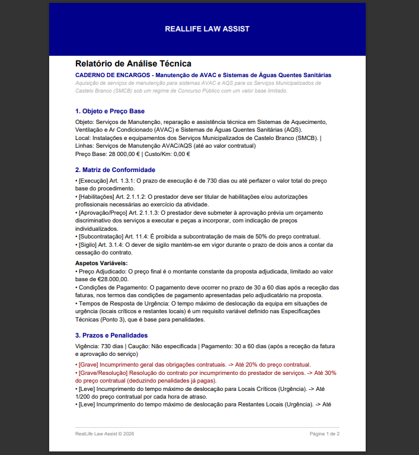
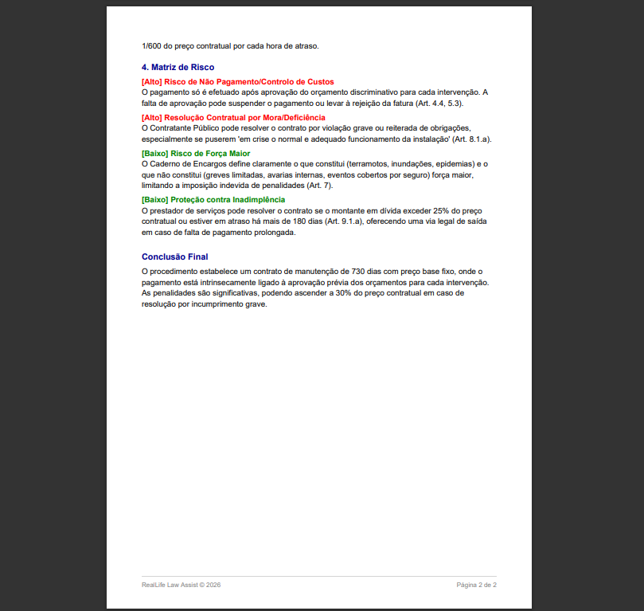

# Law Assist - Analista de Prevenção da Corrupção ⚖️

O **Law Assist** é uma ferramenta de auditoria inteligente desenvolvida em **C#** que utiliza o modelo **Gemini 2.5 Flash** para analisar editais, cadernos de encargos e documentos de contratação pública. O objetivo é identificar automaticamente cláusulas restritivas, indícios de direcionamento ou riscos de corrupção.

## 🚀 Funcionalidades

-   **Análise Multimodal:** Processamento direto de documentos PDF (Cadernos de Encargos).
    
-   **Detecção de Vícios:** Identificação de especificações técnicas que limitam a concorrência.
    
-   **Relatório de Risco:** Geração de um parecer técnico pontuado de 1 a 5.
    
-   **Integração com Portal BASE:** Focado na estrutura de dados da contratação pública em Portugal.
    
## 📂 Fluxo de Entrada e Saída

Entrada: Um ficheiro PDF com o Caderno de Encargos.

Processamento: O software analisa o PDF, identifica riscos e calcula scores.

Saída:

PDF Relatório de Análise Técnica: Análise de risco do Caderno de Encargos AVAC/AQS do SMCB.



HTML Consolidado: Dashboard geral com métricas, gráficos de risco e filtros.


HTML Individual: Relatório detalhado de cada documento analisado.


## 🚀 Tecnologias e Recursos

-   **Linguagem:** C# (.NET)
    
-   **IA:** Google Cloud Vertex AI (Modelo: `gemini-3-pro-preview`)
    
-   **API:** [C# Gemini API SDK](https://googleapis.github.io/dotnet-genai/ "null")
    
-   **Fontes de Dados:** [Portal BASE](https://www.google.com/search?q=https://www.base.gov.pt/Base4/pt/pesquisa/%3Ftype%3Danuncios "null")

## 📦 Configuração Técnica

Para utilizar o cliente da API no projeto, utilize a seguinte estrutura base:

```
// Configuração do Cliente
var client = new Client(apiKey: "SUA_API_KEY");

// 4. Criar as partes da mensagem (Texto + PDF)
var parts = new List<Part> {
    new TextPart("Tu és um analista de documentação para a prevenção da corrupção..."),
    new InlineDataPart(pdfBytes, "application/pdf")
};

Console.WriteLine("A processar o documento...");

// 5. Chamar a API
var response = await client.GenerateContentAsync(parts);

```
## 🔄 Fluxo do Programa

1.  **Início:** O programa inicializa as credenciais.
    
2.  **Entrada:** Solicita ao utilizador o caminho para um ficheiro PDF (ex: Caderno de Encargos).
    
3.  **Análise:** Chama a API do Gemini enviando o documento e as instruções de sistema.
    
4.  **Saída:** Apresenta o relatório de riscos detalhado na consola.

## 🧠 Instruções de Análise (Prompt de Sistema)

O modelo está configurado para analisar os documentos com base nos seguintes pilares:

### 1. Estrutura Obrigatória

-   **Objeto e Preço:** Definição clara do objeto e fixação do Preço Base.
    
-   **Cláusulas:** Distinção entre cláusulas fixas e aspetos variáveis sujeitos à concorrência.
    
-   **Execução:** Definição de prazos, garantias e penalidades claras.
    

### 2. Critérios de Avaliação de Risco

Nível de Risco

Pontuação

Indicadores

🚩 **Alto**

1-2

Especificações "à medida" (ex: dimensões exatas sem motivo), prazos impossíveis, bloqueio de marcas sem menção a "ou equivalente".

✅ **Baixo**

4-5

Descritivos funcionais (focados no resultado), prazos realistas de mercado, regime de multas claro e dissuasor.
## 🔧 Configuração e Execução

### Pré-requisitos

-   .NET SDK instalado.
    
-   Uma API Key do Google AI Studio.
    

### Instalação

1.  Clone o repositório:
    
    ```
    git clone [https://github.com/seu-usuario/law-assist.git](https://github.com/seu-usuario/law-assist.git)
    
    ```
    
2.  Configure a sua chave de API nas variáveis de ambiente:
    
    ```
    export GOOGLE_API_KEY="sua_chave_aqui"
    
    ```
    
3.  Execute o projeto:
    
    ```
    dotnet run
    
    ```
    

## 📄 Exemplo de Prompt de Sistema

O software opera enviando o seguinte contexto para a IA:

> "Tu és um analista jurídico especializado em prevenção da corrupção. Analisa este PDF e identifica se as cláusulas técnicas permitem a livre concorrência ou se estão desenhadas para um fornecedor específico. Atribui uma nota de 1 a 5 com base na transparência."

## ⚖️ Aviso Legal

Esta ferramenta é um assistente de análise e não substitui o parecer de um consultor jurídico ou auditor oficial. O objetivo é triagem e auxílio à tomada de decisão.

## 🔗 Links Úteis

-   [Vertex AI Studio - Multimodal](https://www.google.com/search?q=https://console.cloud.google.com/vertex-ai/studio/multimodal%3Fproject%3Dreallife-law-assist "null")
    
-   [Pesquisa de Anúncios - Portal BASE](https://www.google.com/search?q=https://www.base.gov.pt/Base4/pt/pesquisa/%3Ftype%3Danuncios "null")
    
-   [Documentação .NET GenAI](https://googleapis.github.io/dotnet-genai/ "null")
    

**Nota:** Utilize este software como uma ferramenta de apoio à decisão e não como um veredito legal final.

## 📄 Licença

Distribuído sob a licença MIT. Veja `LICENSE` para mais informações.
