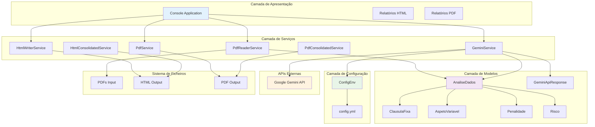

# Diagrama de Arquitetura - Law Assist System

```mermaid
graph TB
    subgraph "Camada de Apresentação"
        CLI[Console Application]
        HTML[Relatórios HTML]
        PDF[Relatórios PDF]
    end
    
    subgraph "Camada de Serviços"
        PS[PdfReaderService]
        GS[GeminiService]
        HS[HtmlWriterService]
        PDFS[PdfService]
        HCS[HtmlConsolidatedService]
        PCS[PdfConsolidatedService]
    end
    
    subgraph "Camada de Modelos"
        AD[AnaliseDados]
        CF[ClausulaFixa]
        AV[AspetoVariavel]
        PE[Penalidade]
        RI[Risco]
        GR[GeminiApiResponse]
    end
    
    subgraph "Camada de Configuração"
        CE[ConfigEnv]
        YML[config.yml]
    end
    
    subgraph "APIs Externas"
        GAPI[Google Gemini API]
    end
    
    subgraph "Sistema de Ficheiros"
        PDFI[PDFs Input]
        HTMLO[HTML Output]
        PDFO[PDF Output]
    end
    
    CLI --> PS
    CLI --> GS
    CLI --> HS
    CLI --> PDFS
    
    PS --> PDFI
    GS --> GAPI
    GS --> CE
    CE --> YML
    
    PS --> AD
    GS --> AD
    GS --> GR
    
    AD --> CF
    AD --> AV
    AD --> PE
    AD --> RI
    
    HS --> HTMLO
    PDFS --> PDFO
    HCS --> HTMLO
    PCS --> PDFO
    
    style CLI fill:#e3f2fd
    style GAPI fill:#fff3e0
    style AD fill:#f3e5f5
    style CE fill:#e8f5e8
```