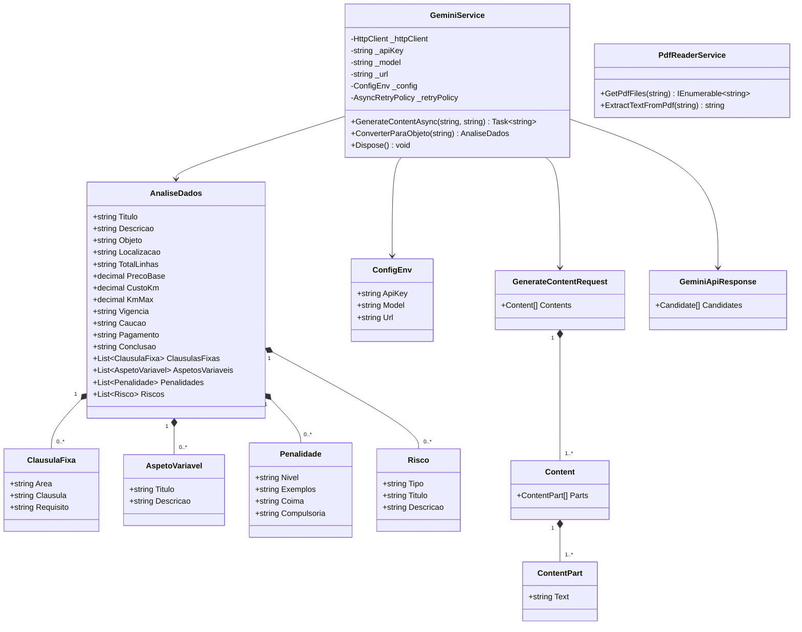

# Diagrama de Classes - Law Assist

```mermaid
classDiagram
    class AnaliseDados {
        +string Titulo
        +string Descricao
        +string Objeto
        +string Localizacao
        +string TotalLinhas
        +decimal PrecoBase
        +decimal CustoKm
        +decimal KmMax
        +string Vigencia
        +string Caucao
        +string Pagamento
        +string Conclusao
        +List~ClausulaFixa~ ClausulasFixas
        +List~AspetoVariavel~ AspetosVariaveis
        +List~Penalidade~ Penalidades
        +List~Risco~ Riscos
    }

    class ClausulaFixa {
        +string Area
        +string Clausula
        +string Requisito
    }

    class AspetoVariavel {
        +string Titulo
        +string Descricao
    }

    class Penalidade {
        +string Nivel
        +string Exemplos
        +string Coima
        +string Compulsoria
    }

    class Risco {
        +string Tipo
        +string Titulo
        +string Descricao
    }

    class GeminiService {
        -HttpClient _httpClient
        -string _apiKey
        -string _model
        -string _url
        -ConfigEnv _config
        -AsyncRetryPolicy _retryPolicy
        +GenerateContentAsync(string, string) Task~string~
        +ConverterParaObjeto(string) AnaliseDados
        +Dispose() void
    }

    class PdfReaderService {
        +GetPdfFiles(string) IEnumerable~string~
        +ExtractTextFromPdf(string) string
    }

    class ConfigEnv {
        +string ApiKey
        +string Model
        +string Url
    }

    class GenerateContentRequest {
        +Content[] Contents
    }

    class Content {
        +ContentPart[] Parts
    }

    class ContentPart {
        +string Text
    }

    class GeminiApiResponse {
        +Candidate[] Candidates
    }

    AnaliseDados "1" *-- "0..*" ClausulaFixa
    AnaliseDados "1" *-- "0..*" AspetoVariavel
    AnaliseDados "1" *-- "0..*" Penalidade
    AnaliseDados "1" *-- "0..*" Risco
    
    GeminiService --> ConfigEnv
    GeminiService --> GenerateContentRequest
    GeminiService --> GeminiApiResponse
    GeminiService --> AnaliseDados
    
    GenerateContentRequest "1" *-- "1..*" Content
    Content "1" *-- "1..*" ContentPart
```