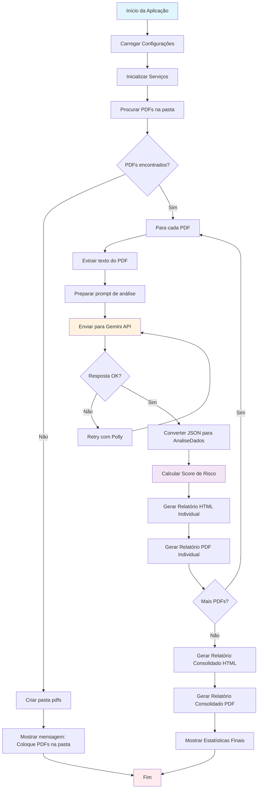

# Diagrama de Fluxo - Processo de Análise

```mermaid
flowchart TD
    A[Início da Aplicação] --> B[Carregar Configurações]
    B --> C[Inicializar Serviços]
    C --> D[Procurar PDFs na pasta]
    
    D --> E{PDFs encontrados?}
    E -->|Não| F[Criar pasta pdfs]
    F --> G[Mostrar mensagem: Coloque PDFs na pasta]
    G --> H[Fim]
    
    E -->|Sim| I[Para cada PDF]
    I --> J[Extrair texto do PDF]
    J --> K[Preparar prompt de análise]
    K --> L[Enviar para Gemini API]
    
    L --> M{Resposta OK?}
    M -->|Não| N[Retry com Polly]
    N --> L
    M -->|Sim| O[Converter JSON para AnaliseDados]
    
    O --> P[Calcular Score de Risco]
    P --> Q[Gerar Relatório HTML Individual]
    Q --> R[Gerar Relatório PDF Individual]
    
    R --> S{Mais PDFs?}
    S -->|Sim| I
    S -->|Não| T[Gerar Relatório Consolidado HTML]
    T --> U[Gerar Relatório Consolidado PDF]
    U --> V[Mostrar Estatísticas Finais]
    V --> H
    
    style A fill:#e1f5fe
    style H fill:#ffebee
    style L fill:#fff3e0
    style P fill:#f3e5f5
```