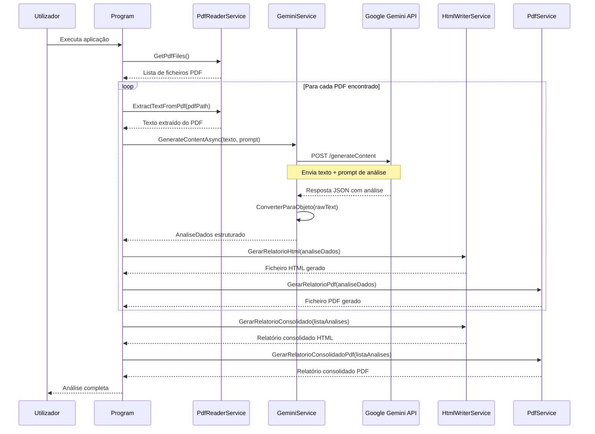

# Diagrama de Sequência - Análise de Documentos

```mermaid
sequenceDiagram
    participant U as Utilizador
    participant P as Program
    participant PDF as PdfReaderService
    participant G as GeminiService
    participant API as Google Gemini API
    participant HTML as HtmlWriterService
    participant PDFOUT as PdfService

    U->>P: Executa aplicação
    P->>PDF: GetPdfFiles()
    PDF-->>P: Lista de ficheiros PDF
    
    loop Para cada PDF encontrado
        P->>PDF: ExtractTextFromPdf(pdfPath)
        PDF-->>P: Texto extraído do PDF
        
        P->>G: GenerateContentAsync(texto, prompt)
        G->>API: POST /generateContent
        Note over G,API: Envia texto + prompt de análise
        API-->>G: Resposta JSON com análise
        G->>G: ConverterParaObjeto(rawText)
        G-->>P: AnaliseDados estruturado
        
        P->>HTML: GerarRelatorioHtml(analiseDados)
        HTML-->>P: Ficheiro HTML gerado
        
        P->>PDFOUT: GerarRelatorioPdf(analiseDados)
        PDFOUT-->>P: Ficheiro PDF gerado
    end
    
    P->>HTML: GerarRelatorioConsolidado(listaAnalises)
    HTML-->>P: Relatório consolidado HTML
    
    P->>PDFOUT: GerarRelatorioConsolidadoPdf(listaAnalises)
    PDFOUT-->>P: Relatório consolidado PDF
    
    P-->>U: Análise completa
```