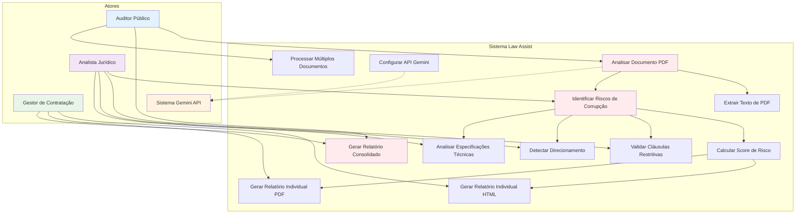

# Diagrama de Casos de Uso - Law Assist

## Descrição dos Casos de Uso

### Atores Principais

- **Auditor Público**: Responsável pela auditoria de processos de contratação pública
- **Analista Jurídico**: Especialista em análise de documentos legais e identificação de riscos
- **Gestor de Contratação**: Responsável por supervisionar processos de contratação
- **Sistema Gemini API**: API externa para análise de documentos com IA

### Casos de Uso Principais

1. **UC1 - Analisar Documento PDF**
   - **Ator**: Auditor Público, Analista Jurídico
   - **Descrição**: Processo principal de análise de um documento PDF
   - **Pré-condições**: Documento PDF válido disponível
   - **Pós-condições**: Análise completa gerada

2. **UC3 - Identificar Riscos de Corrupção**
   - **Ator**: Analista Jurídico
   - **Descrição**: Identifica potenciais riscos de corrupção no documento
   - **Critérios**: Cláusulas restritivas, especificações direcionadas, prazos irreais

3. **UC7 - Gerar Relatório Consolidado**
   - **Ator**: Auditor Público, Gestor de Contratação
   - **Descrição**: Cria relatório consolidado de múltiplas análises
   - **Formatos**: HTML e PDF

4. **UC9 - Validar Cláusulas Restritivas**
   - **Ator**: Analista Jurídico
   - **Descrição**: Verifica se cláusulas limitam a concorrência
   - **Indicadores**: Especificações "à medida", bloqueio de marcas

5. **UC10 - Detectar Direcionamento**
   - **Ator**: Analista Jurídico
   - **Descrição**: Identifica sinais de direcionamento para fornecedor específico
   - **Sinais**: Requisitos únicos, prazos impossíveis

### Fluxos de Extensão

- **UC12 - Processar Múltiplos Documentos**: Extensão do UC1 para análise em lote
- **UC8 - Configurar API Gemini**: Configuração necessária para funcionamento do sistema